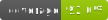

# nwshared

Contact: numbworks@gmail.com

## Revision History

| Date | Author | Description |
|---|---|---|
| 2024-05-19 | numbworks | Created. |
| 2024-08-13 | numbworks | Updated to v1.2.0. |

## Introduction

From the documentation:

> nwshared is a collection of shared components for Python modules.

## Getting started

- [Documentation](docs/docs-nwshared.md)

## Other links

- [LICENSE](LICENSE)